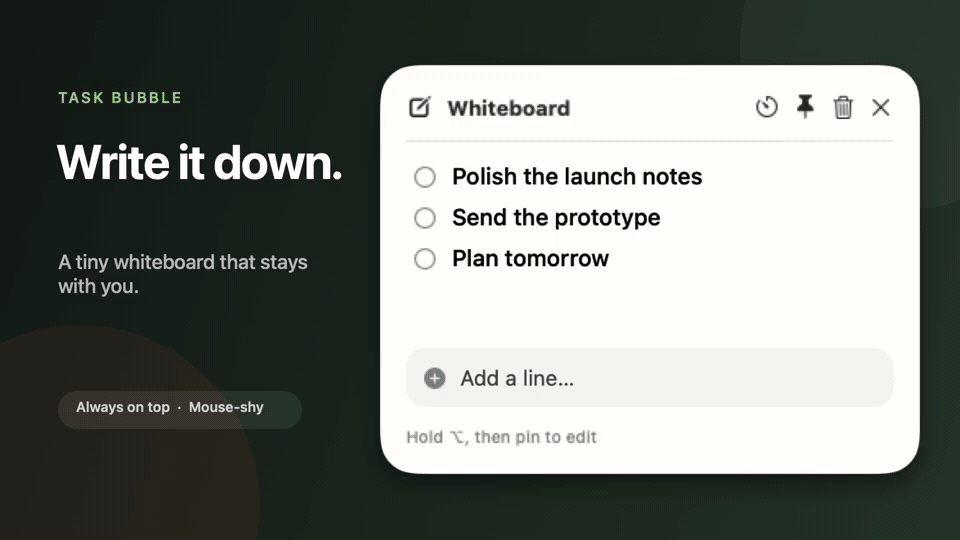

# Task Bubble 🍎

<p align="center">
  <strong>A tiny, mouse-shy whiteboard and Pomodoro timer for your Mac.</strong>
</p>

<p align="center">
  
</p>

Task Bubble stays above ordinary app windows and playfully glides away from the
side your pointer approaches. Catch it when you need it, write down whatever is
on your mind, and cross things off without making them disappear. Then flip the
whole bubble into an apple for a focused 30-minute session—your board will be
waiting when you come back.

## What it does

- Always-on-top, borderless floating panel
- Visible across desktop Spaces and alongside full-screen apps
- Directional pointer avoidance that can cross connected displays
- Hold `Option` to catch the bubble, then use its pin button when you want to interact
- Ordered whiteboard lines that remain in place when crossed out
- 30-minute apple focus timer with pause, resume, reset, progress, completion ding and shake, and notification
- Timer deadlines persist through sleep and relaunch
- Menu-bar controls and no Dock icon
- Respects Reduce Motion

### Build and run

Task Bubble requires macOS 14 or newer and Xcode 16 or Apple's free Xcode
Command Line Tools for Xcode 16. Full Xcode is not required.

```bash
swift test
./scripts/build-app.sh
open "dist/Task Bubble.app"
```

If the repository is already cloned, do not clone it again. Enter the existing
folder and update it with `git pull --ff-only` before building. The build script
compiles Apple silicon and Intel separately so standalone Command Line Tools do
not need the optional XCBuild component.

The build script creates a universal, ad-hoc signed local app for Apple silicon and Intel Macs. A Developer ID signature and notarization are needed before distributing it to other Macs without Gatekeeper warnings.

### Interaction

- Approach the unpinned whiteboard or apple and it moves away from the contact side.
- Keep nudging at a display edge to float the bubble to the center of an adjacent screen.
- Hold `Option` while approaching it to suppress the dodge.
- While holding `Option`, click the pin button to leave it in place for editing or timer controls.
- Use the pin button or menu-bar item to let it roam again.
- Pinning persists when you flip between the whiteboard and focus timer.
- Click the `x` button on either side to quit Task Bubble completely.
- Click the timer button on the whiteboard to flip into the apple and start 30 minutes.
- Crossed-out lines stay on the board and can be restored by clicking the checkmark.
- Right-click a line to delete it permanently.
- Use the trash button to clear the whole whiteboard after confirming the permanent deletion.

## Chrome extension v0.2

The original Chrome extension remains in the repository as `manifest.json`, `background.js`, `content.js`, and `content.css`. It can still be loaded unpacked from `chrome://extensions`; v2 is the native macOS experience.
